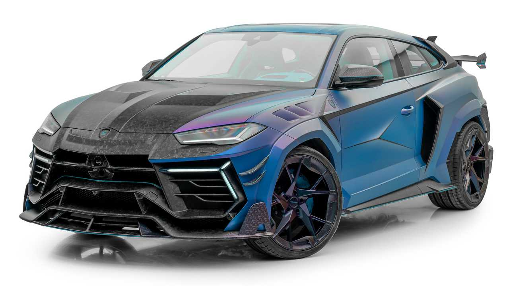

# Elite Cars 🚗


**Sitio web de venta de coches de alta gama desarrollado con HTML, CSS, JavaScript y Bootstrap 5.** Elite Cars permite a los usuarios explorar un catálogo de vehículos exclusivos, gestionar su cuenta de usuario, añadir productos al carrito y consultar su historial de pedidos, todo en una interfaz responsive con componentes web reutilizables.

***

## Descripción

Elite Cars es una tienda online de automóviles de lujo y alto rendimiento. El catálogo incluye vehículos como el Lamborghini Urus Mansory, Porsche 911 GT3 RS, Mercedes-AMG Clase A, Mercedes G Brabus, MINI John Cooper Works y Volkswagen Golf GTI Clubsport. El proyecto está estructurado como una SPA estática con múltiples páginas HTML y componentes web personalizados.

***

## Capturas de pantalla

| Página de inicio | Catálogo de productos |
|:----------------:|:--------------------:|
|  |  |

***

## Catálogo de vehículos

| Vehículo | Imagen |
|:--------:|:------:|
| **Lamborghini Urus Mansory** |  |
| **Porsche GT3 RS** |  |
| **Mercedes G Brabus** |  |
| **Mercedes Clase A AMG** |  |
| **MINI John Cooper Works** |  |
| **Volkswagen Golf GTI Clubsport** |  |

***

## Características principales

- 🏎️ **Catálogo de vehículos**: listado de coches de alta gama con imágenes, nombre y precio.
- 🛒 **Carrito de compra**: los usuarios pueden añadir vehículos al carrito antes de finalizar el pedido.
- 👤 **Gestión de usuario**: formulario de inicio de sesión con campos de usuario y contraseña y enlace a registro de nueva cuenta.
- 📋 **Panel de usuario registrado**: muestra datos personales e historial de pedidos, todo editable inline.
- 🧩 **Componentes web reutilizables**: `<mi-cabecera>` y `<mi-pie>` como Custom Elements de la Web Components API.
- 📱 **Diseño responsive**: navbar que colapsa en móvil gracias a Bootstrap 5 (breakpoint `md`).
- 🔗 **Redes sociales**: footer con iconos de Twitter, Instagram y Facebook (Font Awesome 5).

***

## Estructura del proyecto

```
EliteCars/
├── Web/
│   ├── FicherosHTML/
│   │   ├── InicioEliteCars.html
│   │   ├── EmpresaEliteCars.html
│   │   ├── ContactoEliteCars.html
│   │   ├── ProductosEliteCars.html
│   │   ├── CarritoEliteCars.html
│   │   ├── UsuarioEliteCars.html
│   │   ├── UsuarioIniciadoEliteCars.html
│   │   └── RegistrarUsuarioEliteCars.html
│   ├── FicherosJS/
│   │   ├── Cabecera_EliteCars.js  # Custom Element <mi-cabecera>
│   │   └── PiePag_EliteCars.js    # Custom Element <mi-pie>
│   ├── FicherosCSS/
│   │   └── InicioEliteCars.css
│   └── ImagenesCoches/        # Imágenes de los vehículos y logo
└── screenshots/            # Capturas de pantalla del README
```

***

## Componentes web personalizados

### `<mi-cabecera>` — `Cabecera_EliteCars.js`
Custom Element que inyecta la barra de navegación fija en todas las páginas. Incluye marca EliteCars, menú de navegación, iconos de Usuario y Carrito, y botón hamburguesa para móvil.

### `<mi-pie>` — `PiePag_EliteCars.js`
Custom Element que inyecta el pie de página fijo con copyright y enlace a redes sociales (Twitter, Instagram, Facebook).

***

## Páginas principales

| Página | Archivo | Descripción |
|--------|---------|-------------|
| Inicio | `InicioEliteCars.html` | Portada del sitio |
| Empresa | `EmpresaEliteCars.html` | Información sobre la empresa |
| Contacto | `ContactoEliteCars.html` | Formulario de contacto |
| Productos | `ProductosEliteCars.html` | Catálogo de vehículos |
| Carrito | `CarritoEliteCars.html` | Cesta de la compra |
| Usuario (login) | `UsuarioEliteCars.html` | Inicio de sesión y registro |
| Panel de usuario | `UsuarioIniciadoEliteCars.html` | Datos del cliente y pedidos |

***

## Tecnologías utilizadas

- **HTML5** — estructura semántica.
- **CSS3** — estilos personalizados complementarios a Bootstrap.
- **JavaScript (ES6+)** — lógica del cliente y Custom Elements.
- **Bootstrap 5.3.2** — grid responsive, navbar y componentes UI.
- **Web Components API** — Custom Elements para cabecera y footer reutilizables.
- **Font Awesome 5.15.1** — iconos vectoriales.

***

## Instalación

1. Clona el repositorio:
   ```bash
   git clone https://github.com/Llarry793/EliteCars.git
   ```
2. Abre `Web/FicherosHTML/InicioEliteCars.html` en tu navegador o usa un servidor estático:
   ```bash
   python -m http.server 8080
   ```

***

## Posibles mejoras futuras

- Añadir un **backend** (Node.js + Express) con base de datos real.
- Implementar **autenticación real** con JWT.
- Migrar a **React, Vue o Svelte**.
- Añadir **buscador y filtros** en el catálogo.
- Integrar **pasarela de pago** (Stripe, PayPal).

***

## Autor

Desarrollado por **Óscar** (UV) — maquetación responsive con Bootstrap, Web Components nativos y organización modular HTML/JS/CSS.
